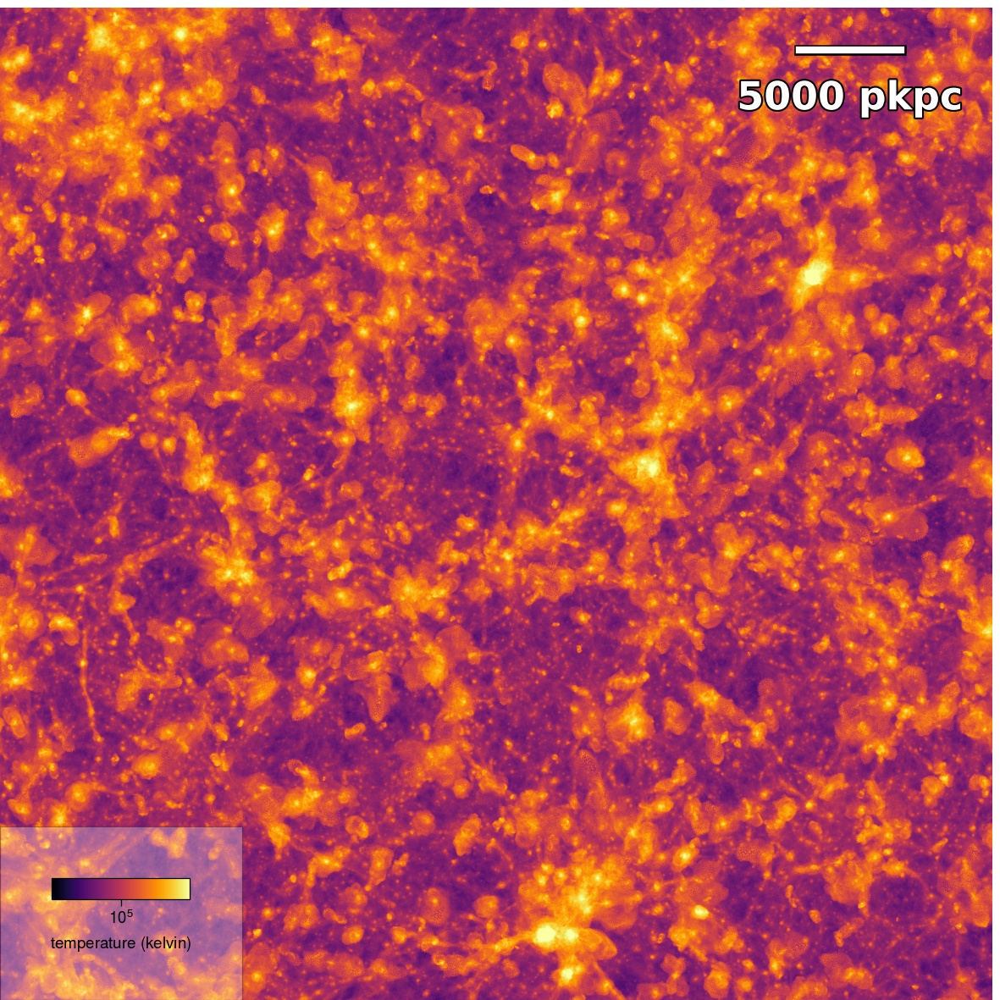
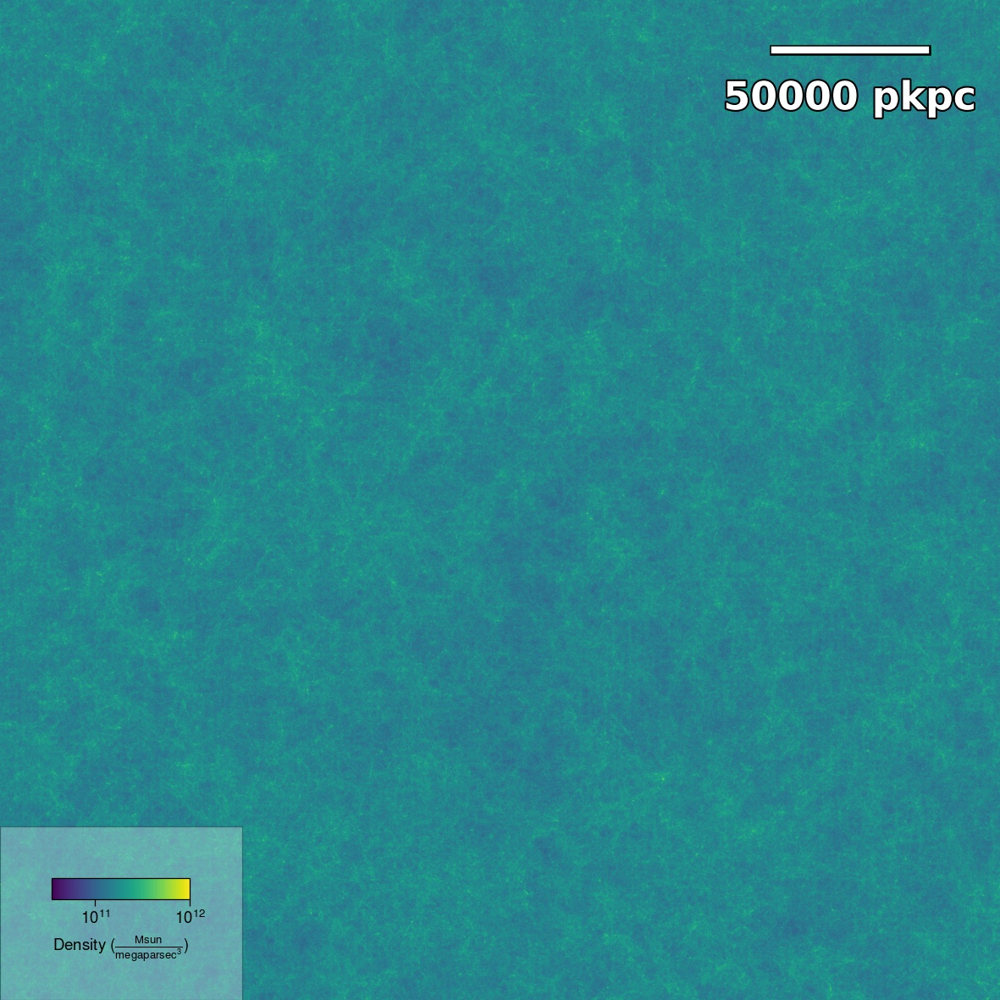
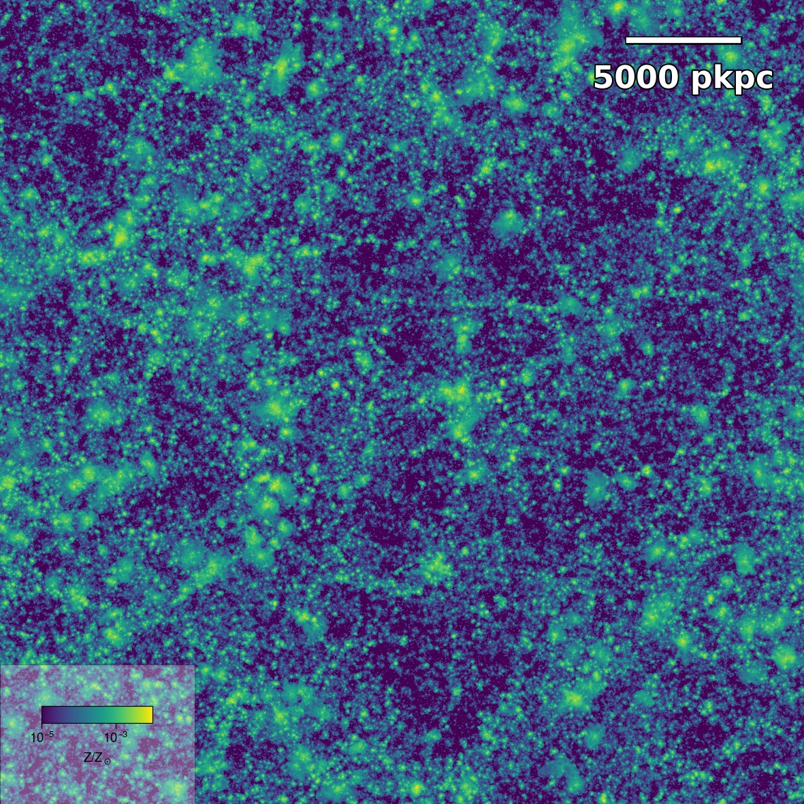
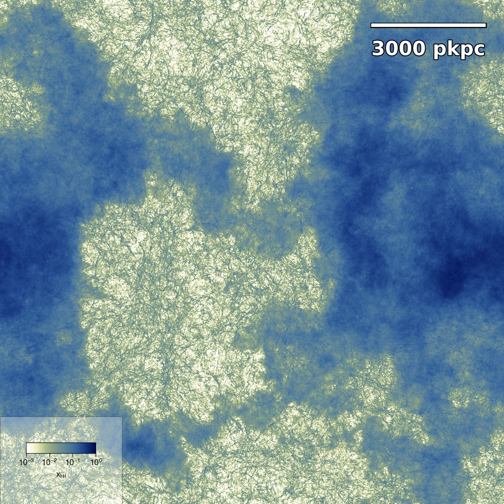
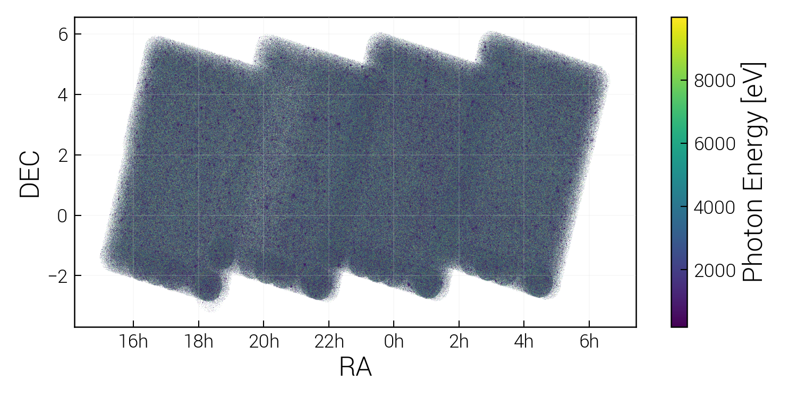
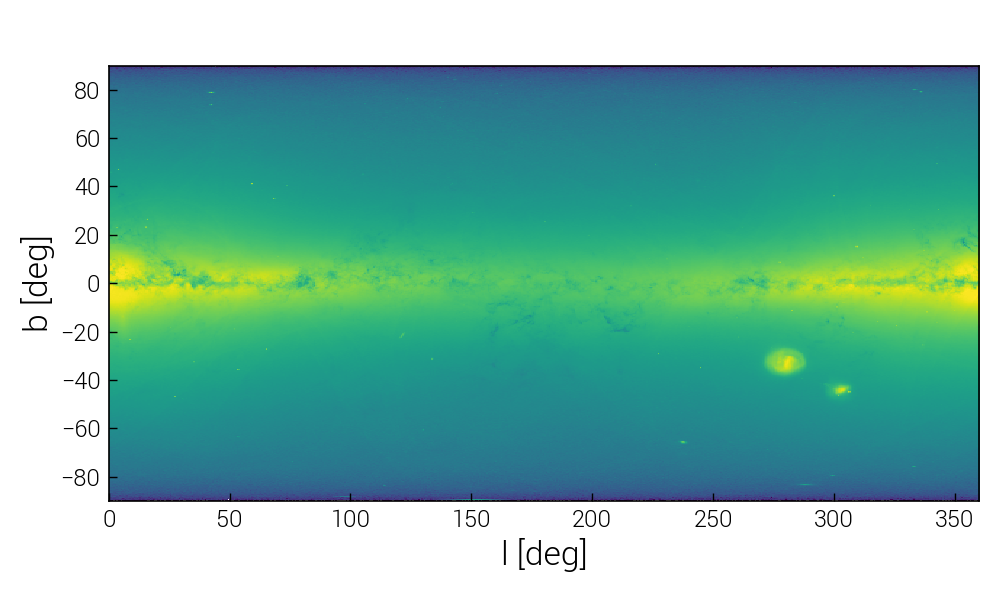

# Visual impressions using scida

The following images were created using scida with matplotlib.

## Simulations

Plots from the SIMBA, FLAMINGO, TNG100 and THESAN simulations.

{: style="height:300px"}
{: style="height:300px"}
{: style="height:300px"}
{: style="height:300px"}

## Observational data

Plots from the SDSS DR16, eROSITA-DE DR1 and Gaia DR3.

{: style="height:350px"}
{: style="height:350px"}
