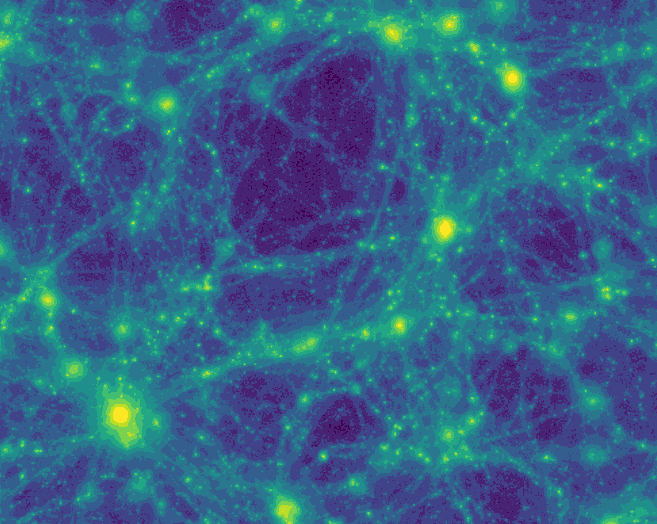

<section class="cards">
   

      

        
      

      

        

          Simulations
        

        

          
Tutorial on a simulation dataset.

        

      

    

    

      

        
      

      

        

          Observations
        

        

          
Tutorial on an observational dataset.

        

      

    

</section>
