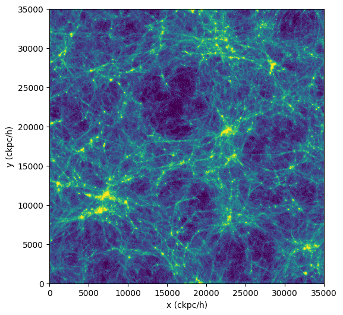

## Getting started

!!! info "Tutorial dataset"
    In the following, we will use a small test dataset from the [TNG50](https://www.tng-project.org/) simulation.
    This is a cosmological galaxy formation simulation. This dataset is still a gigabyte in size and can be downloaded [here](https://heibox.uni-heidelberg.de/f/dc65a8c75220477eb62d/).
    On the command line, you can download and extract the dataset with:

    ``` bash
    wget "https://heibox.uni-heidelberg.de/f/dc65a8c75220477eb62d/?dl=1" -O snapshot.tar.gz
    tar -xvf snapshot.tar.gz
    ```
    The snapshot will be extracted into a folder called *snapdir_030*.

    Note that analysis is not limited to simulations, but also observational data.
    Check [Supported Datasets](../supported_data.md) for an incomplete list of supported datasets
    and requirements for support of new datasets.
    A shorter tutorial for an observational dataset can be found [here](observations.md).


This package is designed to aid in the efficient analysis of large simulations,
such as cosmological (hydrodynamical) simulations of large-scale structure.
Datasets are expected to be spatially [unstructured](https://en.wikipedia.org/wiki/Unstructured_grid), e.g. tessellation or particle based.
Much of the functionality can also be used to process observational datasets.

It uses the [dask](https://dask.org/) library to perform computations, which has several key advantages:

1. very large datasets which cannot normally fit into memory can be analyzed,
2. calculations can be automatically distributed onto parallel 'workers', across one or more nodes, to speed them up,
3. we can create abstract graphs ("recipes", such as for derived quantities) and only evaluate on actual demand.

## Loading an individual dataset

The first step is to choose an existing snapshot of a simulation.
To start, we will intentionally select the output of TNG50-4 at redshift z=2.32,
which is the lowest resolution version of [TNG50](https://www.tng-project.org/),
a suite for galaxy formation simulations in cosmological volumes.
Choosing TNG50-4 means that the data size in the snapshot is small and easy to work with.
We demonstrate how to work with larger data sets at a later stage.

First, we load the dataset using the convenience function `load()` that will determine the appropriate dataset class for us:


```pycon title="Loading a dataset"
>>> from scida import load
>>> ds = load("./snapdir_030")
>>> ds.info() #(1)!
class: ArepoSnapshotWithUnitMixinAndCosmologyMixin
source: /vera/u/byrohlc/Downloads/snapdir_030
=== Cosmological Simulation ===
z = 2.32
cosmology = FlatLambdaCDM(H0=67.74 km / (Mpc s), Om0=0.3089, Tcmb0=0.0 K, Neff=3.04, m_nu=None, Ob0=0.0486)
===============================
=== Unit-aware Dataset ===
==========================
=== data ===
+ root (containers: 5)
++ PartType0 (fields: 10, entries: 19124236)
++ PartType1 (fields: 3, entries: 19683000)
++ PartType3 (fields: 2, entries: 19683000)
++ PartType4 (fields: 9, entries: 161401)
++ PartType5 (fields: 20, entries: 2673)
============
```

1. Call to receive some information about the loaded dataset.

!!! info "Specifying the load path"
    Here, we passed the directory "snapdir_030" as the path to `load()`.
    In detail, it will depend on the desired dataset type to be loaded which path to pass to `load()`,
    but generally this is the base folder containing all relevant data.
    In above example, you could also use path="snapdir_030/snap_030.0.hdf5",
    however this would only load this file's content, a fraction of all data.

The dataset is now loaded, and we can inspect its contents, specifically its container and fields loaded.
We can access the data in the dataset by using the `data` attribute, which is a dictionary of containers and fields.

From above output we see that the dataset contains seven containers, each of which contains a number of fields.
For this snapshot, the containers are *PartType0*, *PartType1*, *PartType3*, *PartType4*, *PartType5*, *Group*, and *Subhalo*.
The containers represent gas cells, dark matter particles, stars, black holes, groups and subhalos, respectively.
Each container contains fields that are specific to the container, such as the mass of the gas cells, the velocity of the dark matter particles, etc.
The fields are described in the [TNG50 documentation](https://www.tng-project.org/data/docs/specifications/).

The available fields of the container "PartType0" are:

```pycon title="Available fields of a given container"
>>> ds.data["PartType0"].keys() #(1)!
['Coordinates',
 'Density',
 'ElectronAbundance',
 'GFM_Metallicity',
 'InternalEnergy',
 'Masses',
 'ParticleIDs',
 'StarFormationRate',
 'Temperature',
 'Velocities']
```

1. For many simulation types aliases exist, such that "gas" can be used instead of "PartType0", "stars" instead of "PartType4", etc.

Let's take a look at some field in this container:

```pycon title="Inspecting a field"
>>> gas = ds.data["PartType0"]
>>> gas["StarFormationRate"]
'dask.array<mul, shape=(19124236,), dtype=float32, chunksize=(19124236,), chunktype=numpy.ndarray> Msun / year'
```

The field is a dask array, which is a lazy array that will only be evaluated when needed.
How these lazy arrays and their units work and are to be used will be explored in the next section.

## Dask arrays and units

### Dask arrays
Dask arrays are virtual entities that are only evaluated when needed.
If you are unfamiliar with dask arrays, consider taking a look at this [3-minute introduction](https://docs.dask.org/en/stable/array.html).

They are **not** numpy arrays, but they can be converted to them, and have most of their functionality.
Within dask, an internal task graph is created that holds the recipes how to construct the array from the underlying data.

In our case, in fact, the snapshot and its fields are split across multiple files on disk (as for most large datasets),
and virtually combined into a single dask array. The user does not need to worry about this as these operations take place in the background.

For the TNG50-4 datasets, the first level of `ds.data` maps the different particle types (such as gas and dark matter),
and the second level holds the different physical field arrays (such as density and ionization).

In general, fields can be also be stored in flat or more nested structures, depending on the dataset.

We can trigger the evaluation of the dask array by calling `compute()` on it:

```pycon title="Evaluating a dask array"
>>> gas["StarFormationRate"].compute()
'[0.017970681190490723 0.0 0.016353357583284378 ... 0.0 0.0 0.0] Msun / year'
```

**However**, directly evaluating dask arrays is **strongly discouraged** for large datasets, as it will load the entire dataset into memory.
Instead, we will reduce the datasize by running desired analysis/reduction within dask before calling *compute()*,
which we present in the next section.

### Units

If passing `units=True` (default) to `load()`, the dataset will be loaded with code units attached to all fields.
These units are attached to each field / dask array. Units are provided via the pint package.
See the [pint documentation](https://pint.readthedocs.io/en/stable/) for more information.
Also check out [this page](../units.md) for more unit-related examples.

In short, each field, that is represented by a modified dask array, has a magnitude (the dask array without any units attached) and a unit.
These can be accessed via the `magnitude` and `units` attributes, respectively.

```pycon  title="Accessing the magnitude and units of a field"
>>> gas["Coordinates"].magnitude
'dask.array<mul, shape=(19124236, 3), dtype=float32, chunksize=(11184810, 3), chunktype=numpy.ndarray>'
>>> gas["Coordinates"].units
'code_length'
```

When defining derived fields from dask arrays, the correct units are automatically propagated to the new field,
and dimensionality checks are performed. Importantly, the unit calculation is done immediately, thus allowing
to directly see the resulting units and any dimensionality mismatches.


## Analyzing snapshot data
### Computing a simple statistic on (all) particles

The fields in our snapshot object behave similar to actual numpy arrays.

As a first simple example, let's calculate the total mass of gas cells in the entire simulation. Just as in numpy we can write

```pycon title="Calculating the total mass of gas cells"
>>> masses = ds.data["PartType0"]["Masses"]
>>> task = masses.sum()
>>> task
'dask.array<sum-aggregate, shape=(), dtype=float32, chunksize=(), chunktype=numpy.ndarray> code_mass'
```

Note that all objects remain 'virtual': they are not calculated or loaded from disk,
but are merely the required instructions, encoded into tasks.

We can request a calculation of the actual operation(s) by applying the `.compute()` method to the task.

```pycon
>>> totmass = task.compute()
>>> totmass
'57384.59375 code_mass'
```

??? tip "Converting units"

    We can easily convert the code units to something physically meaningful by using the `.to()` method of the task or its computed result:

    ```pycon title="Converting units"
    >>> totmass.to("Msun")
    '8.3e15 Msun'
    ```
As an example of calculating something more complicated than just `sum()`, let's do the usual "poor man's projection" via a 2D histogram.

To do so, we use [da.histogram2d()](https://docs.dask.org/en/latest/array.html) of dask,
which is analogous to [numpy.histogram2d()](https://numpy.org/doc/stable/reference/generated/numpy.histogram2d.html),
except that it operates on a dask array.
We discuss more advanced and interactive visualization methods [here](../visualization.md).

```pycon
>>> import dask.array as da
>>> import numpy as np
>>> coords = ds.data["PartType0"]["Coordinates"]
>>> x = coords[:,0]
>>> y = coords[:,1]
>>> nbins = 512
>>> bins1d = np.linspace(0, ds.header["BoxSize"], nbins+1)
>>> hist, xbins, ybins = da.histogram2d(x,y,bins=[bins1d,bins1d])
>>> im2d = hist.compute() #(1)!
>>> import matplotlib.pyplot as plt
>>> from matplotlib.colors import LogNorm
>>> fig = plt.figure(figsize=(6, 6))
>>> plt.imshow(im2d.T, norm=LogNorm(vmin=25, vmax=500), extent=[0, ds.header["BoxSize"], 0, ds.header["BoxSize"]], cmap="viridis")
>>> plt.xlabel("x (ckpc/h)")
>>> plt.ylabel("y (ckpc/h)")
>>> plt.show()
```

1. The *compute()* on `im2d` results in a two-dimensional array which we can display.



## Catalogs
Many cosmological simulations have a catalog of halos, subhalos, galaxies, etc.

For AREPO/Gadget based simulations, we support use of this information. Find more find more information on how to use catalogs [here](../halocatalogs.md).
